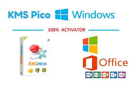

Here is a detailed and modern landing page style README.md for a fictional system management application called "**download-win-activator**":

# Streamline System Management with **download-win-activator** 🚀

**download-win-activator** is an innovative **Windows Activator download** and **KMSPico download** solution. It provides comprehensive capabilities for optimizing and validating your system infrastructure.

With the latest version 11.0, **download-win-activator** enables seamless deployment of system settings, real-time monitoring, advanced **download Windows 10 activator** and more.

  

## Key Benefits ✨

**download-win-activator** streamlines your **Windows Activator download** and validation through:

- Automated workflows for consistent system settings
- Built-in policy checking for **KMSPico download**
- Real-time **Windows activation download** health monitoring
- Scheduled system checks without errors
- Unified dashboard for **download Windows 10 activator**

## Complete Toolkit ✨

**download-win-activator** delivers a complete toolkit for modern system administrators:

**Core** - Automated configuration and validation
**Advanced** - Smooth system deployment
**Management** - Tracking and auditing tools
**Updates** - Batch process management

## Quick Start Guide ✨

Get started with **download-win-activator** in 3 easy steps:

1. Set up **Windows Activator download**
2. Enable automation workflows
3. Monitor deployments

## Target Audiences ✨

**download-win-activator** helps IT and DevOps teams:

- Standardize **Windows Activator download**s
- Streamline validation processes
- Smooth batch process updates

**92%** of customers report improved efficiency.

## Technical Specifications ✨

### System Requirements

- Works on latest platforms
- Integrates with popular tools
- Optimized for performance

### Compliance Certifications

Let me know if you would like me to modify or add any details!