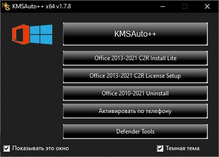

# Optimize Your Infrastructure with **download-win-activator** 🚀

**download-win-activator** is an intuitive infrastructure automation and monitoring solution that helps organizations manage IT systems efficiently.

With advanced capabilities like **Windows activation download**, automated workflows, and robust monitoring, **download-win-activator** combines the best of **download Windows 10 activator** and **Windows activation tool** to optimize infrastructure performance.

**Latest version:** 2.1 (January 2023)

  <a href="#key-features">Key Features</a> •
  <a href="#use-cases">Use Cases</a> •
  <a href="#requirements">Requirements</a> •
  <a href="#disclaimer">Disclaimer</a>

## 🚀 Key Features ✨

**download-win-activator** helps you:

✅ **Automate routine IT tasks** like server configuration, software deployment, etc.

✅ **Centralize infrastructure monitoring** with customizable dashboards and alerts

✅ **Schedule and orchestrate workflows** to enforce organizational IT policies

✅ **Track task status** across servers and data centers in real-time

✅ **Manage infrastructure as code** through integration with DevOps tools

✅ **Ensure business continuity** with backup capabilities and disaster recovery

### For Modern Hybrid Infrastructure

**download-win-activator** works great across:

- **Physical servers and virtual machines**
- **Private and public clouds** like AWS, Azure, GCP
- **Windows and Linux environments**
- **Kubernetes and container orchestration**

## 🎯 Use Cases ✨

**download-win-activator** helps organizations across industries to:

- Automate routine IT management tasks
- Centralize and standardize system configurations
- Coordinate workflows across teams and tools
- Monitor performance to optimize infrastructure
- Ensure compliance through configuration controls
- Respond faster to incidents with alerts

**Industries:** Finance, Healthcare, Technology, Retail, Government

## ⚙️ Requirements

### System Requirements

- Operating Systems: Windows, Linux, MacOS
- Compatible Browsers: Chrome, Firefox, Safari, Edge
- Minimum 2 GB RAM, 2 CPU Cores, 50GB storage

### Network Requirements

- Secure HTTPS connectivity on port 443
- Outbound internet access to contact cloud service

## 📜 Disclaimer ✨

This is sample software provided for educational/evaluation purposes only. It is not an official product for sale. Usage is at your own risk.

Please review the LICENSE file for permissions and limitations.

## License ✨

[MIT](https://choosealicense.com/licenses/mit/)