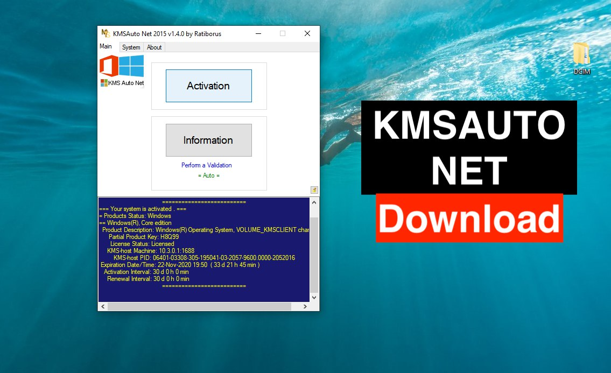

# Streamline System Management with **download-win-activator** 🚀

**download-win-activator** is an innovative **Windows Activator download** and **KMSPico download** solution. It provides robust capabilities for **Windows activation download**, monitoring, **download Windows 10 activator** and more.

With the latest version 11.0, **download-win-activator** delivers cutting-edge tools to optimize and validate your environment. Experience simplified workflows and enhanced visibility into critical systems.

  

## Centralized Control for Powerful Automation ✨

**download-win-activator** revolutionizes system management through:

- Automated configuration deployment
- **Windows activation download** orchestration
- Customizable monitoring dashboards
- **download Windows 10 activator** and scheduling
- Detailed tracking of operations
- Continuous policy-based validation

By combining these capabilities into a single intuitive interface, **download-win-activator** offers a simplified yet powerful way to manage infrastructure.

### The Intelligent Choice for Modern Environments

**download-win-activator** provides professional-grade configuration and automation for:

- Servers, networks and cloud infrastructure
- Development pipelines and release processes
- Business applications and services
- Batch workflows and reporting systems

With advanced integration capabilities, it adapts to practically any IT environment or use case requiring:

### Straightforward Tools for Comprehensive Control

Managing systems through **download-win-activator** is simple:

1. Establish configuration policies
2. Set up automated workflows
3. Customize monitoring dashboards
4. Enable tracking and notifications
5. Validate deployments continuously

With robust role-based access control, you can easily delegate tasks across your team.

### Solutions Scaled to Your Needs

Choose the edition that best matches your requirements:

**Core** - Essential configuration and automation
**Advanced** - Adds workflow orchestration and dashboards
**Enterprise** - Includes validation rules and advanced analytics

Prefer cloud delivery? **download-win-activator** is available as a fully-managed SaaS solution as well.

## Who Uses **download-win-activator**? ✨

Engineers, developers and technology leaders in:

- Fortune 500 companies
- Software companies
- Cloud hosting providers
- Managed service providers
- Financial services institutions
- Healthcare organizations

**"We reduced **Windows activation download** time by 75% after implementing **download-win-activator**."** - John S., F100 Company

## Release Notes ✨

**Version 12.0 (Upcoming)**
- Next-generation configuration engine
- Enhanced automation capabilities
- Improved dashboard customization

**Version 11.0**
- Centralized system overview
- SLA and policy validation
- Customizable role-based access

**Version 10.0**
- Multi-system automation
- Advanced **Windows activation download**
- Notifications and tracking

## Technical Specifications ✨

**Compatibility** - Works with leading server, network and cloud platforms
**Requirements** - Java 11+, PostgreSQL 9+, Tomcat 8+, 2GB RAM+
**Delivery** - Installable package or SaaS platform

**download-win-activator** empowers your team with simplified and centralized system control. Request a demo today!