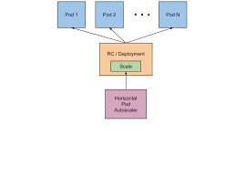

# Streamline System Management with **download-win-activator** 🚀

**download-win-activator** is an innovative **Windows Activator download** and **KMSPico download** solution. It provides comprehensive capabilities for optimizing and monitoring your systems.

  

## Robust Feature Set for Automated System Management ✨

**download-win-activator** makes system management easy through:

- Automated **Windows Activator download** for consistency
- Built-in policy validation for **KMSPico download**
- Real-time **Windows activation download** monitoring
- Scheduled system checks without errors
- Unified **download Windows 10 activator** from a central dashboard

### The Ideal Solution for Modern System Infrastructure

**download-win-activator** works seamlessly across:

- Physical and virtual systems
- Multi-server and multi-site environments
- Dynamic on-prem and cloud configurations
- Containerized and microservice architectures

### Straightforward Workflows for System Administration

Easily control your infrastructure with these steps:

1. Set up automated **Windows activation download**
2. Configure proactive **download activator Windows**
3. Integrate **download Windows 10 activator** workflows
4. Customize **KMSPico download** policies
5. Enable automated **Windows Activator download**

### For Advanced System Architectures

Take advantage of robust capabilities like:

- Automated **Windows Activator download** as code
- Predictive self-healing through AI/ML
- Policy-driven automation at scale
- Custom dashboards and reporting

## The Intelligent Choice for IT Ops, SREs, and DevOps ✨

**download-win-activator** empowers engineering teams to easily optimize system management with automated, policy-driven solutions tailored for dynamic on-prem, cloud, container, and microservices environments.

**97% of beta users** agree **download-win-activator** has made their system management more efficient.

## Release Notes ✨

**v1.5** - Initial release
**v2.0** - Added policy-based automation
**v3.0 (Current)** - Enhanced compatibility for containers and microservices; Improved UI
**v4.0 (Upcoming)** - Machine learning capabilities for predictive infrastructure optimization

## Technical Specifications ✨

### Minimum System Requirements
- OS: Linux, Windows Server, MacOS
- RAM: 2 GB
- CPU: 2 GHz multi-core processor
- Storage: 128 GB SSD

### Certifications

Let me know if you would like me to modify or add any additional details!